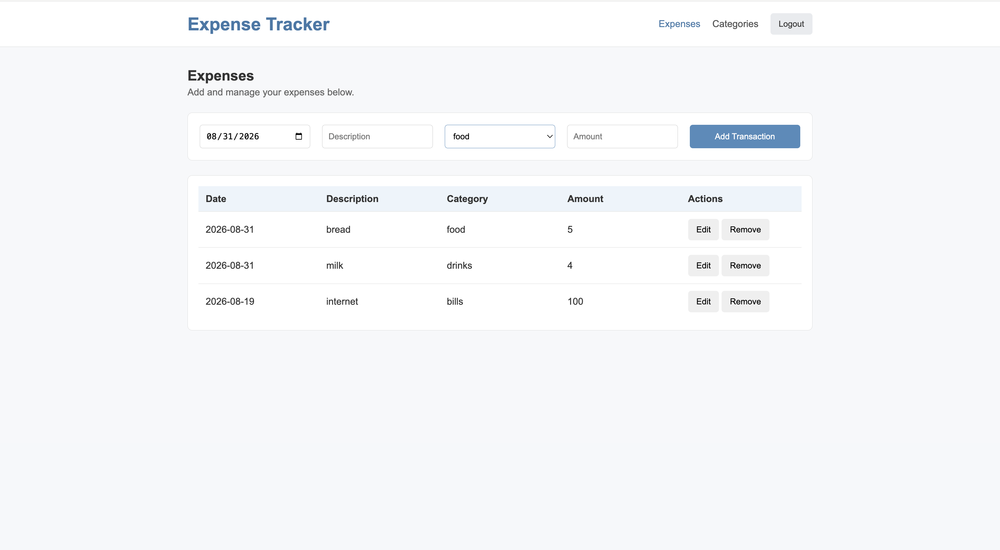
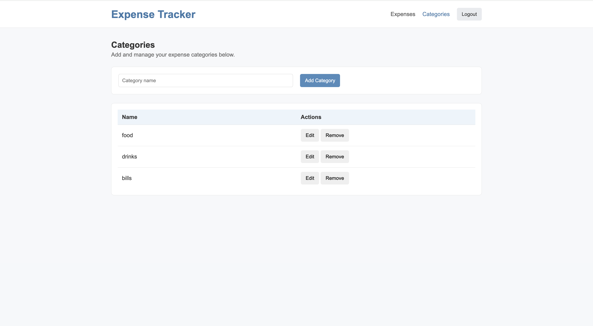
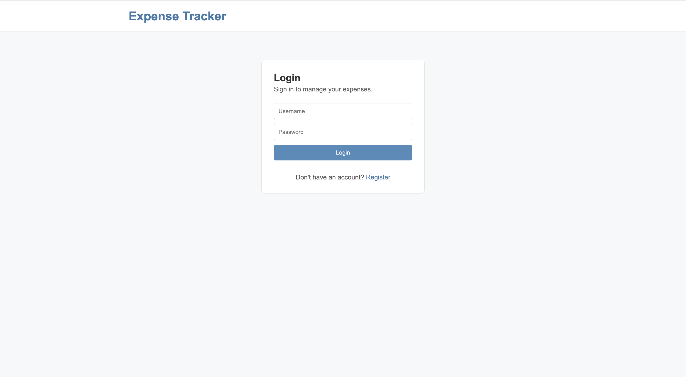

# Expense Tracker Web App

This is a full-stack coursework project for tracking personal expenses. The app allows users to register, log in, manage categories, and add, view, edit, or delete their own expense records.

## My Contributions

* Implementing the server-side Expenses API and expense state logic
* Writing and updating unit tests for expense functionality
* Adding MySQL database storage for expenses and categories
* Implementing category CRUD functionality across the database, API, and client
* Updating the database structure to support multiple users
* Implementing user registration and login
* Adding password hashing with bcrypt
* Adding JWT-based authentication and protected API requests
* Adding login, logout, and client-side token handling
* Updating existing tests
* Improving the UI
* Setting up GitHub Actions for automated testing

The course provided the project structure, requirements, and some starter code and tests, while I implemented and extended the required functionality.

## Technologies Used

* JavaScript
* Node.js
* MySQL
* HTML/CSS
* REST API
* bcrypt
* JSON Web Tokens
* Vitest
* GitHub Actions

## How to Run Locally

Install dependencies:

```bash
cd expenses-tracker
npm install
```

Create a local `.env` file here:

```text
server/state/database/.env
```

Use `.env.example` as a guide.

Set up the database:

```bash
node server/state/database/dbSetup.mjs
```

Start the server:

```bash
node server/main.mjs
```

Open the app:

```text
http://localhost:8000
```

## Demo Login

```text
Username: alice
Password: password123
```

You can also create a new account through the Register page.

## Screenshots

### Expenses



### Categories



### Login



## Testing

The project includes tests for the client side, server side, database logic, authentication, routing, and API behavior.

Run the tests with:

```bash
cd expenses-tracker
npm test
```

GitHub Actions automatically runs the tests. 